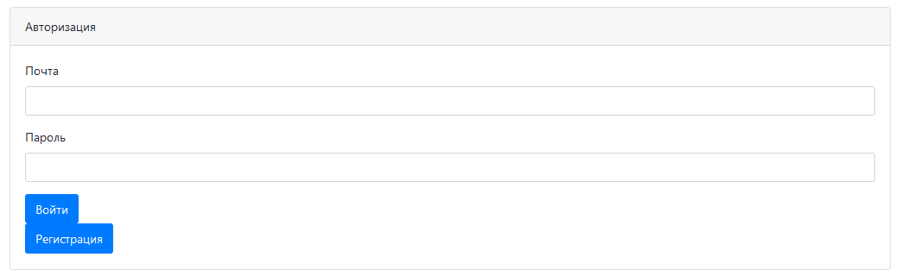
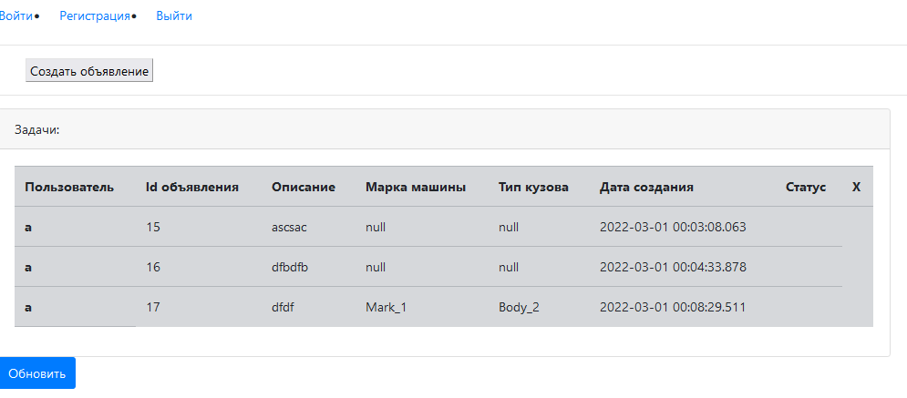
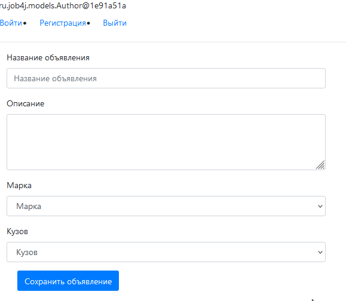

Проект "Продажа машин"
Проект создавался для знакомства с Hibernate.
Используется связка Hibernate - PostgreSQL.

В проекте присутствует простая система авторизации и регистрации пользователей.

На главной странице отображается таблица объявлений. 

Присутствует возможность добавить объявление.

Проект требует доработки. В частности планируется:
- добавить возможность отметить объявление, как "Закрытое", где машина уже продана;
- добавить возможность удалить объявление(frontend);
- наладить работу кнопки "Обновить"(frontend). 
